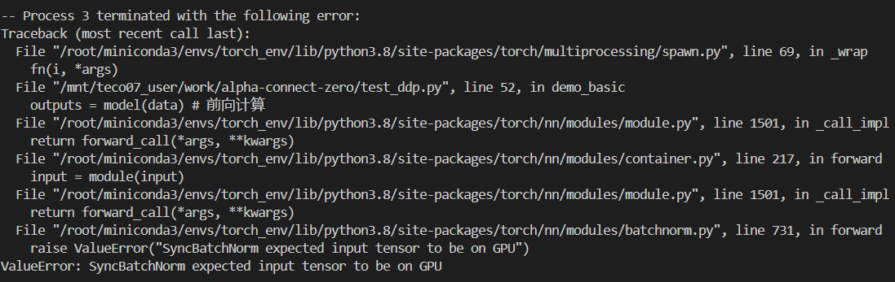

# 错误报告
在普通深度学习模型训练中（本文的所有问题在文末附测试demo），出现了以下问题：
### 编译环境
采用了该docekr内的虚拟环境
```
jfrog.tecorigin.net/tecotp-docker/release/ubuntu22.04/x86_64/training    1.3.0-teco_training1.3.0-modelzoo    694aa937ee06   6 weeks ago    16.1GB
```
### 存在的BUG
#### BUG1
- 在启用SyncBatchNorm层时发现，
    SyncBatchNorm出现: ValueError: SyncBatchNorm expected input tensor to be on GPU.
    
    定位到最后的文件，/root/miniconda3/envs/torch_env/lib/python3.8/site-packages/torch/nn/modules/batchnorm.py
    730行发现**if not input.is_cuda:**。
    ```py
    if not input.is_cuda:
                raise ValueError("SyncBatchNorm expected input tensor to be on GPU")
    ```


### 避坑

- 进程启动后必须使用 set_device
- tccl 时: 每个卡似乎只能跑一个进程
- gloo 时: 可以单卡多进程, 但是不能DDP
- 


### 测试demo
```py
import os
import torch
import torch_sdaa
import torch.nn as nn
import torch.optim as optim
import torch.multiprocessing as mp
from torch.nn import functional as F
# 导入DDP所需的依赖库
# from model import ZeroModel
import torch.distributed as dist
from torch.nn.parallel import DistributedDataParallel as DDP

# 设置IP:PORT，框架启动TCP Store为ProcessGroup服务
os.environ['MASTER_ADDR'] = 'localhost' # 设置IP
os.environ['MASTER_PORT'] = '29503'     # 设置端口号

USE_TEST_MODEL = False
def demo_basic(rank, world_size):                                  
    # 必须在初始化ProcessGroup之前进行set device，tccl限制
    device = torch.device(f"sdaa:{rank}")
    torch.sdaa.set_device(device)
    # 初始化ProcessGroup，通信后端选择tccl
    dist.init_process_group('tccl', rank=rank, world_size=world_size)
    # dist.init_process_group('gloo', rank=rank, world_size=world_size)

    if USE_TEST_MODEL:
        model = nn.Linear(10, 10).to(device) # 构造模型
        model = nn.Sequential(
            nn.Linear(10, 10),
            nn.BatchNorm1d(10),
            nn.ReLU(),
            nn.Linear(10, 10)
        ).to(device)
        # SyncBatchNorm出现: ValueError: SyncBatchNorm expected input tensor to be on GPU
        # model = torch.nn.SyncBatchNorm.convert_sync_batchnorm(model)
        ddp_model = DDP(model, device_ids=[rank]) # DDP model
        loss_fn = nn.MSELoss() # 定义loss
    else:
        # 以下是我们的模型的一个单元的测试，与demo无关
        # model = ZeroModel(9, (1, 9), 1).to(device)
        # # SyncBatchNorm出现: ValueError: SyncBatchNorm expected input tensor to be on GPU
        # # model = torch.nn.SyncBatchNorm.convert_sync_batchnorm(model)
        # ddp_model = DDP(model, device_ids=[rank]) # DDP model

    optimizer = torch.optim.Adam(ddp_model.parameters(), lr=0.001) # 定义优化器

    model.train() # 设置训练模型
    for i in range(1000):
        if USE_TEST_MODEL:
            data= torch.randn(20, 10).to(device) # 数据放到device上
            labels = torch.randn(20, 10).to(device) # 标签数据放到device上
            outputs = model(data) # 前向计算
            loss = loss_fn(outputs, labels) # loss计算
            loss.backward() # loss反向传播
        else:
            data = torch.randn(20, 1, 9, 9).to(device)   
            action_batch = torch.randn(20, 1, 9).to(device)
            value_batch = torch.randn(20, 1).to(device)
            optimizer.zero_grad()
            pred_act, pred_value = ddp_model(data)
            loss_policy = F.kl_div(torch.log(pred_act), action_batch, reduction='batchmean')
            loss_value = F.mse_loss(pred_value, value_batch)
            loss = loss_policy + loss_value
            loss.backward()   


        optimizer.step() # 更新参数
        print(f"rank:{rank}, loss:{loss.cpu().item()}")

def main(demo_fn, world_size):
    mp.spawn(demo_fn,
             args=(world_size,),
             nprocs=world_size,
             join=True)

if __name__ == "__main__": # 主程序入口
      world_size=4 # 4张卡进行训练 
      main(demo_basic, world_size)
```