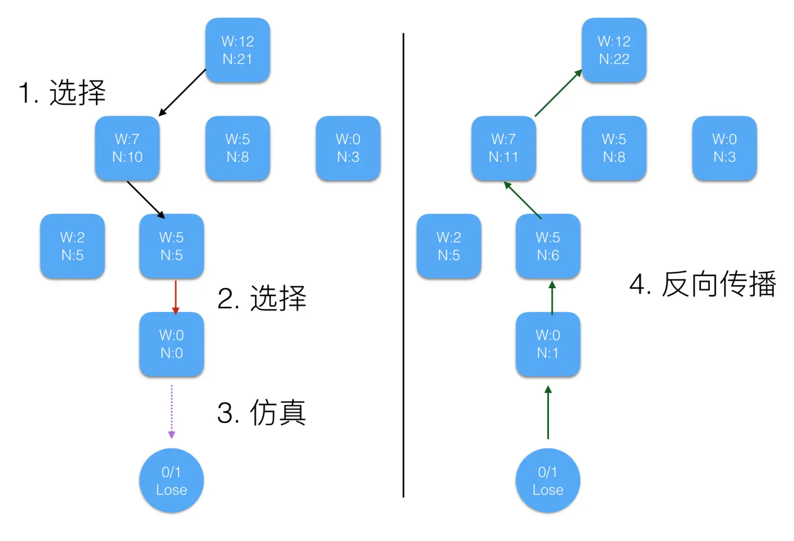

# AlphaGoZero pro 在四子棋游戏中的实现

## Introduction
在本次大作业中，我们构建了一个通用的框架AlphaGoZero pro，它能够灵活处理各类“连子棋”游戏，包括五子棋、四子棋、井字棋等，并且可以自动适配不同棋盘大小和连子数量的游戏规则，同时对网络模型结构（搜索树等）进行相应调整。本次报告主要以AlphaGoZero算法在四子棋游戏中的应用为例，进行测试与分析，并通过在四子棋游戏中的实践，探索不同损失函数、不同噪声策略、不同超参数以及不同搜索算法对游戏结果的影响。

## Approach

### 游戏环境框架
本项目构建了多个经典连接类棋盘游戏的环境框架，核心是以ConnectGame为基类，提供通用游戏逻辑，通过继承与扩展实现不同游戏规则。例如，GameState类用于表示游戏状态，包含棋盘、当前玩家、游戏是否结束等信息；ConnectGame类提供基础游戏功能，如重置棋盘、执行玩家操作、检查胜负、生成合法移动、计算奖励等。具体子类包括ConnectFour（9x9格子，四子连接胜，落子只能选择列）、Gomoku（15x15格子，五子连珠胜）、TicTacToe（3x3格子，三子连线胜）。此外，通过对称性增强数据，提升训练效率并减少搜索空间，适用于单人游戏、双人对战或AI训练。

### 搜索算法
本文的搜索算法主要是通过搜索树算法来完成的，主要实现了MiniMax与蒙特卡洛搜索树，以及基于蒙特卡洛搜索树，在其基础上进行改进的AlphaConnectZero算法。
0. **SearchTree**架构
    TreeNode 用于构建搜索树的节点，每个节点代表游戏中的一个状态。
    SearchTree 是一个抽象类，包含搜索算法的框架和自我对弈等功能。它有两个子类Minimax与蒙特卡洛搜索树。
    Minimax：使用极小化-极大化算法来搜索最佳动作。
    MCTS：使用蒙特卡洛树搜索算法，具有选择、扩展、模拟和反向传播等方法。
    AlphaConnectZero ：继承自MCTS ，重写了expand() 和 simulate().

1. **MiniMax**
    MiniMax是一种递归算法，用于在零和博弈（如井字棋、五子棋、国际象棋等）中帮助选择最佳决策。它通过模拟所有可能的游戏状态，尝试最小化对手的得分（假设对手总是做出最优选择），并最大化自己的得分。
    - MiniMax总是存在最优解并且简单直观：在完全信息的零和博弈中，MiniMax 总能找到最优解。并且其算法思想基于递归和穷举，易于理解。
    - 但是它在大型的任务中计算开销大，MiniMax在训练过程中会遍历整个状态空间树，复杂度为 O(b^d)，其中：b 是每层的合法动作数（分支因子）。d 是搜索的深度。
    该算法在我们四子棋小游戏中表现尚可，但如果在真正的大型棋类游戏（如围棋）中，状态空间非常庞大，直接使用 MiniMax 会导致计算不可行。

2. **蒙特卡洛树搜索（MCTS）**
    MCTS能够通过模拟大量可能的游戏状态，逐步构建决策树并利用“蒙特卡洛模拟”来做出决策。每个节点代表游戏中的一个状态，通过探索、扩展、模拟和回传等步骤，逐渐得到每个动作的评估。MCTS 算法的核心是四个步骤：
    - **选择**：依据公式$\frac{w_{i}}{n_{i}}+c \sqrt{\frac{ln t}{n_{i}}}$选择子结点，其中$w_{i}$代表第$i$次移动后取胜的次数，$n_{i}$代表第$i$次移动后仿真的次数，$c$为探索参数（理论上等于$\sqrt{2}$，实际中通常凭经验选择），$t$代表仿真总次数（等于所有$n_{i}$的和）。选择子结点的难点在于平衡较高平均胜率移动后的深层次利用和少数模拟移动的探索。
    蒙特卡洛树搜索 (Monte Carlo Tree Search, MCTS) 是一种用于决策过程的启发式搜索算法，广泛应用于棋类游戏（如围棋、国际象棋）和其他状态空间较大的问题。
    - **扩展**: 如果该叶节点不是终止状态，就生成所有可能的后继节点，并选择一个进行扩展。
    - **模拟**: 从扩展的节点开始进行蒙特卡洛模拟（通常是随机选择动作直到游戏结束），并得到一个奖励（奖励通常是根据游戏的最终结果给定）。
    - **反向传播**: 将模拟的结果回传给树的所有祖先节点，更新节点的访问次数和评分。
    这些步骤将会重复多次，直到达到指定的迭代次数，从而逐渐改进树的评估。

3. **AlphaGoZero搜索**：基于MCTS，重写了expand()和simulate()方法，公式为$u(s, a)=Q(s, a)+c \cdot P(s, a) \cdot \frac{\sqrt{N(s)}}{1+N(s, a)}$。这里引入了$Q(s, a)$（当前节点状态$s$下，动作$a$的价值评估）、$N(s)$（访问状态$s$的次数）、$P(s, a)$（策略网络给出的概率）等概念，$c$为探索参数。

### 模型结构与损失函数
1. **模型结构**：包含多层卷积和全连接层，如Conv2d、Resnet、Policy Conv、Value Conv等，最终输出动作概率和价值。


2. **损失函数**：如代码所示，计算模型预测的动作概率(pred_act)和价值(pred_value)，然后计算策略损失（交叉熵）和价值损失（均方误差），并将两者相加得到总损失。接着反向传播计算梯度，更新模型参数，并返回损失值。（在选择损失函数时，我们曾经尝试过KL散度，但无论训的轮数多少，总是效果很差。）
```py
    def _train_step(self, state_batch, action_batch, value_batch):
        dist.barrier()
        pred_act, pred_value = self.model(state_batch
        loss_policy = F.cross_entropy(pred_act, action_batch)
        loss_value = F.mse_loss(pred_value, value_batch)
        loss = loss_policy + loss_value
        self.optimizer.zero_grad()
        loss.backward()     # backward before all_reduce, otherwise the gradients will not be autogradiented
        dist.all_reduce(loss, op=dist.ReduceOp.SUM) 
        loss /= dist.get_world_size()
        for param in self.model.parameters():
            dist.all_reduce(param.grad.data, op=dist.ReduceOp.SUM)  
            param.grad.data /= dist.get_world_size()
        self.optimizer.step()
        return loss.item()
```

### 数据处理
1. **数据表示**：AlphaGoZero模型输入部分需要特定格式，包含棋盘状态、当前玩家棋子信息等。可能的改进方向包括取消“棋手”通道（统一为黑棋视角，将白棋行动的数据反转）、增加“合法行动”通道（表示当前state下可行的落子位置）、使用数据增强的输入（根据游戏规则对称性输入多个等价state，输出取各对称棋盘的均值）。
2. **自对弈数据生成**：通过模拟多局游戏来生成数据，每局游戏利用搜索算法生成动作，并记录每一步的状态、动作概率和当前玩家。游戏结束后，计算奖励并转换为训练数据。若启用数据增强，还会额外生成并扩展增强后的数据，最终返回所有游戏的数据集。在这个过程中，使用了随机迪利克雷噪声扰动$\tilde{\pi}(a | s)=(1-\epsilon) \cdot \pi(a | s)+\epsilon \cdot n(a)$（其中$n(a)$是从迪利克雷分布获取的随机噪声，$\epsilon$是控制噪声对策略影响的超参数）、温度系数$\pi(a | s)=\frac{e^{z_{a} / T}}{\sum_{b} e^{z_{b} / T}}$（$z_{a}$是策略网络对动作$a$输出的原始分数，$T$是温度系数，用来调节输出的平滑度）、MCTS树的继承等技巧。
3. **数据增强**：通过旋转（90°、180°、270°）、转置、反射（垂直、水平、沿对角线）等操作生成新样本，增强数据集。具体实现是将原始状态和动作概率进行转置，然后进行四次旋转，每次旋转后再次转置，生成多个变换后的样本，最终返回增强后的数据集。

## Result
实现了AI vs. AI以及AI vs. Human的对战接口，可进行各类树搜索算法与人类对战或AI自对抗。
- AI vs. Human 过程展示

- AI vs. AI 过程展示
## Running Codes
- 1.克隆代码库：
    ```bash
    git clone https://github.com/vlln/AlphaConnectZero.git
    ```
- 2.启动自对弈训练：
    ```
    python train.py #文件内部进行相关超参数设置
    ```
- 3.自对弈训练结束后进行单人游戏（由于每训练一个epoch保存一次模型参数，训练过程中随时可进行游戏，可清楚感受到越训练越聪明）：
    ```
    python human_play.py
    ```

## 小组分工
- 高盛：负责项目整体架构设计与算法实现；完成实验代码编写；汇报。
- 惠瑞泽：负责模型的分布式训练管理；协助进行代码调试；完成技术报告撰写与汇报展示PPT。

## Requirements
    numpy>=1.24.4
    torch>=2.4.1
    loguru>=0.7.2